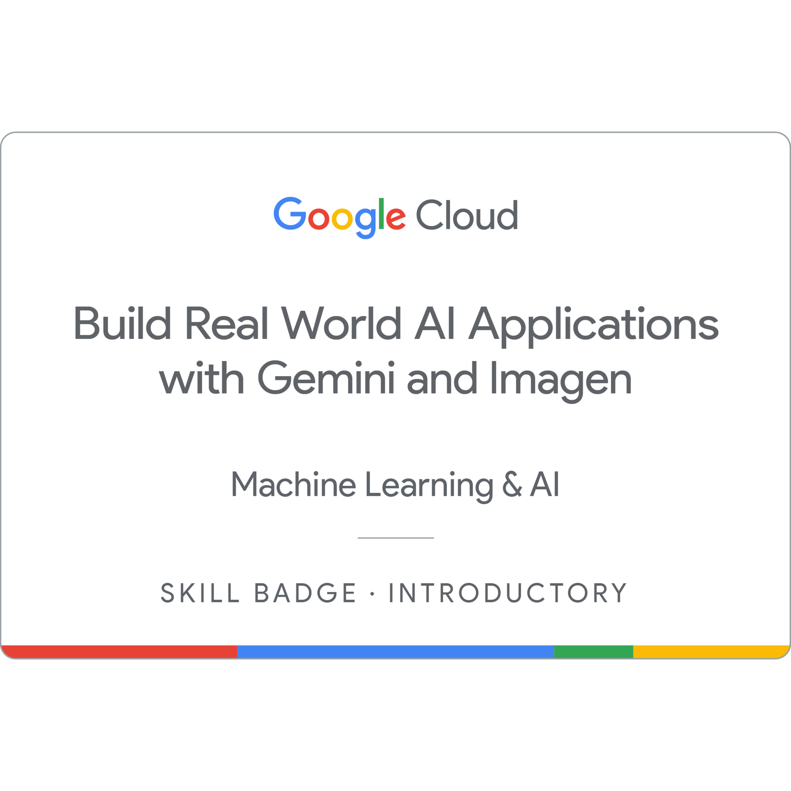

# 🎓 Gen AI Exchange Program Certificates

Welcome to my **Google Cloud Gen AI Exchange Program** certificate repository!  
Here you will find the certificates I earned after completing these cutting-edge courses designed to master generative AI tools and applications.

---

## 📚 Completed Courses

| Course Name                                                                 | Description                                                                                           |
|-----------------------------------------------------------------------------|---------------------------------------------------------------------------------------------------|
| **Prompt Design in Vertex AI**                                              | Craft effective prompts to optimize AI model responses and build smarter interactions using Vertex AI. |
| **Develop GenAI Apps with Gemini and Streamlit**                           | Build and deploy interactive GenAI applications by integrating Gemini models with Streamlit.       |
| **Inspect Rich Documents with Gemini Multimodality and Multimodal RAG**    | Extract insights from complex documents using multimodal AI techniques and Retrieval-Augmented Generation (RAG). |
| **Build Real-World AI Applications with Gemini and Imagen**                | Create impactful, production-ready AI apps leveraging Gemini's text and Imagen's image generation models. |
| **Explore Generative AI with the Gemini API in Vertex AI**                 | Hands-on experience with Gemini API to generate text and experiment with GenAI workflows.           |

---

## 🎖 Certificates

The certificates below correspond to the courses listed above:

| Vertex AI | Prompt | Multimodality | Applications | Streamlit |
| --------- | ------ | ------------- | ------------ | --------- |
|  |  |  |  |  |

*Click on any image to view/download the certificate.*

---

## About the Program

The **Google Cloud Gen AI Exchange Program** equips learners with practical skills in generative AI, focusing on real-world applications and hands-on projects using Google Cloud’s latest AI services.

---

Thank you for visiting! Feel free to reach out if you want to learn more about these courses or the projects I’ve done.

---

*Made with ❤️ using Google Cloud Gen AI Academy*

---

📌 _This repo is part of my public AI learning journey._
